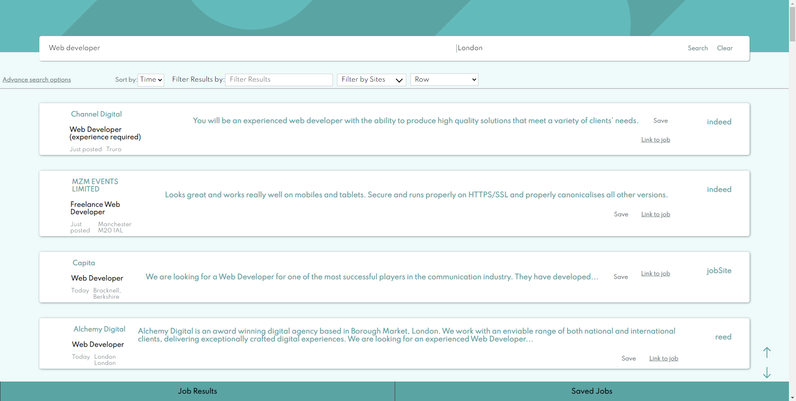
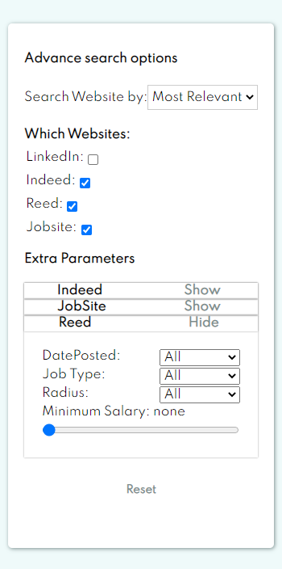

# Job-Scrapper project

_JobScrapper website and server using react and puppeteer_ 


## Summary
This project scrapes the first page of results in job websites such as reed, jobsite, linkedin and indeed. It does this by using a nodejs server and scraping information from each site with puppeteer.

**[Demo]()** 

I created this as I enjoyed making the job filter design challenge from one of my [github repos](https://github.com/Pudderz/Job-listings) ([frontendmentor.io challenge](https://www.frontendmentor.io/challenges/job-listings-with-filtering-ivstIPCt)) to try and get as close to a design as possible and wanted to do more with it. I also was not able to get the apis for each job website so I thought this would be a fun opportunity to learn about puppeteer and how to scrape job websites for information. 


## Table of content

1. [What I used in this project](#What-I-used-in-this-project)
    1. [What I used in this project](#What's-used-in-this-project)
    2. [References used](#References-used)
1. [Websites it can scrape information from](#Websites-it-can-scrape-information-from)    
2. [Parts of the Website](#Parts-of-the-website)
    1. [Search page](#search-page)
    2. [Puppeteer server](#puppeteer-server)
    3. [Advanced Search options](#advanced-search)  
    4. [Saved Jobs](#gallery)
    6. [PWA](#PWA)
1. [Installation](#installation)    
3. [Issues I had and changes I made](#Issues-I-had-and-changes-I-made)
4. [Improvements](#Improvements)


## Websites it can currently scrape information from
* LinkedIn
* Indeed
* Reed
* JobSite


## Parts of the Website

### Search page


#### Advanced Search Options



The advanced search options allows the user to pick which sites they want to scrape and which parameters to send to the website such as date posted and job type etc.

### Saved Jobs


Saved Job Page loads the jobs the you have saved into the indexedDB. IDB-keyval is used here to simplify using indexedDB and it makes it easier to access the database in each component easily and without the need to check and setup it up.


### Puppeteer server
#### How it works
The server listens for a request, once received it creates the urls for each of the selected websites from what was asked to scrape and the extra parameters the user has chosen. Once done, it opens the requested websites and scrapes each job from the front page of each website and send the job information back to the user via server sent events. I use server sent events here so that the user can track the progress of the server scraping via a loadbar with text details showing and telling the current progress.


#### Issues I had
The main issue I had with creating this puppeteer server was scraping the posted at details for each site as they would return a range of values such as 'yesterday', 'Expires in 3 days' and 'Posted 3 september'. This was a problem as it didnt give me a proper time or date value to use to be able to sort the information client side via time. To fix this I created two functions that worked out an estimate for he number of days it has been from the day it has been posted and sent that with each job item to the client.   

### PWA


## What's used in this project
* Javascript
* Sass
* React
* Puppeteer
* idb-keyval
* React-router
* Service-worker
* express
### References used


## Installation
Steps to install the neccessary files:

1. Clone the Repo:
```bash
git clone https://github.com/Pudderz/Job-Search.git
```
2. Change the directory into the server and install the neccessary dependencies with [`npm`](https://www.npmjs.com/) and then the same with the client folder 

```bash
cd server
npm install


cd ./client
npm install
```

### Run the program
1. Create a build file
```bash
cd ./client
npm run build
```
2. Copy build file and paste it into the public folder in the server folder

3. Run server
```bash
cd server
node index.js
```
4. The server will be available on http://localhost:3000/


## TO DO
1. Add pagination to the server so the user can browse throught multiple pages instead on just the first page of results

2. Add ability to reconnect where the user left off from the server if disconnected mid scrape  

3. Add the option to organise the saved jobs information into different sections such as collections that the user has named and created to help the them better organise their saved Jobs. 
