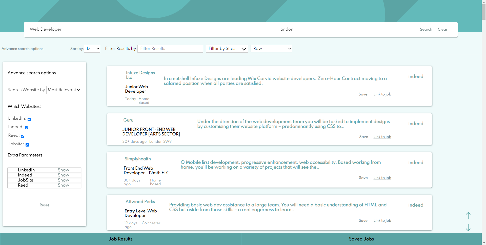
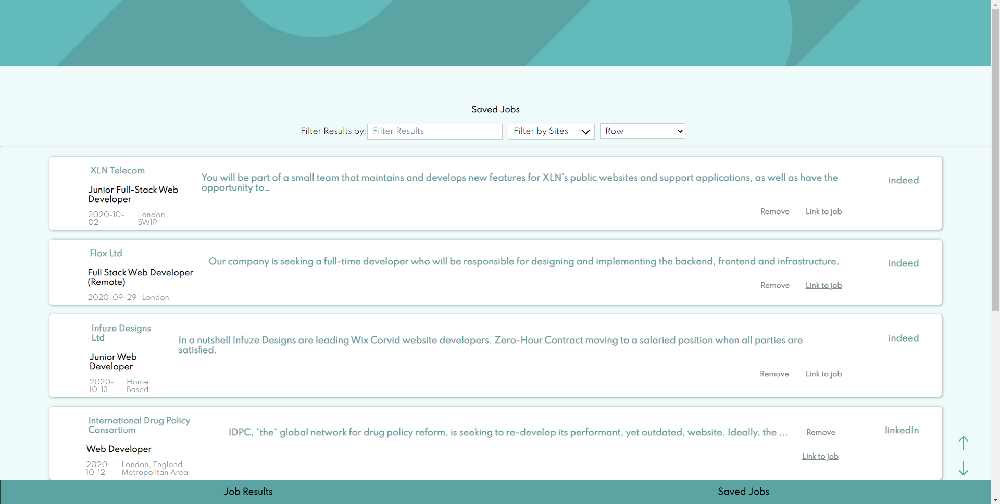

# Job-Scraper project

_JobScraper website and server using React and Puppeteer_ 

**[Demo](http://puppeteer-job-scraper.herokuapp.com/)** -
LinkedIn is not available in the demo and is currently only working on http not https

## Summary
This project scrapes the first page of results in job websites such as Reed, Jobsite, LinkedIn, and indeed. It does this with a Node.js server and scraping information from each site with Puppeteer.

I created this as I enjoyed making the job filter design from one of my [GitHub repos](https://github.com/Pudderz/Job-listings) ([frontendmentor.io challenge](https://www.frontendmentor.io/challenges/job-listings-with-filtering-ivstIPCt)), to get as close to a design specification as possible, and wanted to build onto it. I was not able to get the APIs for each job website, so I thought this would be a fun opportunity to learn about Puppeteer and how to scrape sites for information. 


## Table of content
1. [Websites it can currently scrape information from](#Websites-it-can-currently-scrape-information-from)
1. [Technologies used in this project](#What-I-used-in-this-project)
3. [References used](#References)
2. [Parts of the Website](#Parts-of-the-website)
    1. [Search page](#search-page)
    2. [Puppeteer server](#puppeteer-server)
    4. [Saved Jobs](#gallery)
4. [Improvements](#Improvements)
1. [Installation](#installation)    

## Websites it can currently scrape information from
* LinkedIn
* Indeed
* Reed
* JobSite

## Technologies used in this project
* Javascript
* Sass
* React
* Puppeteer
* idb-keyval
* React-router
* express
## References 
* [Observations running 2 million headless sessions](https://docs.browserless.io/blog/2018/06/04/puppeteer-best-practices.html) 

## Parts of the Website

### Search page


#### Search and filter section
The filter section can filter jobs by position/job, sites and sort the results by the id they came in or the time they were posted. There is also a layout select button that changes the results layout into small columns, medium columns, or rows. 

Above the filter section, a load bar will display once a new search has been sent. The load bar uses the server-sent responses from the server to displays load status and progress of the download to the client. 
#### Advanced Search Options
The advanced search options allow the user to pick which sites they want to scrape and which parameters to send to the website, such as date posted and job type, etc.

### Saved Jobs


Saved Job Page loads the jobs you have saved into the indexedDB. IDB-keyval is used here to simplify using indexedDB and it makes it easier to access the database in each component easily and without the need to check if the database is set up.


### Puppeteer server
#### How it works
Once the server has received a request, it creates the URLs for each of the selected websites based on the given parameters. Once done, it opens the requested websites, scrapes each job from the front page of each website, and sends the job information back to the user via server-sent events. I use server-sent events here so that the user can track the progress of the server scraping via a load bar with text details showing and telling the current progress.

#### Issues I had
##### Getting the dates
A small issue I had with creating this puppeteer server was scraping the posted at details for each site to use to sort the information client-side. Each site would return a range of values such as yesterday,  Expires in 3 days, Recently, and Posted 3 September" which are not a proper time or date value.  To fix this, I use two simple functions that worked out via regex and switch statements an estimate for the number of days it has been posted. The server sends the results with each job item to the client.  
##### Memory Leak
The main issue I had was to do with puppeteer chromium which at the start of this project started on the server creation. The request time was much faster than opening the browser and closing it after each client transaction. However, leaving the browser open on the server slowed my pc during testing due to a memory leak after a few hours of the server running. I worked out that this was because the browser likes to cache stuff and slowly eat more memory. Instead, I made sure the browser opened and closed after each client transaction with the server preventing a memory leak.

## Improvements
1. Add pagination feature to the server so the user can browse through multiple pages instead of just the first page of results of each site

2. Add ability to reconnect where the user left off from the server if disconnected mid scrape  

3. Add the option to organise saved jobs information into different sections such as collections and lists that the user has named and created to help them better organise their saved Jobs. 

4. Use CSS modules to clean up styles and reduce chances of certain components changing other components

## Installation
Steps to install the neccessary files:

1. Clone the Repo:
```bash
git clone https://github.com/Pudderz/Job-Search.git
```
2. Change the directory into the server and install the neccessary dependencies with [`npm`](https://www.npmjs.com/) and then the same with the client folder 

```bash
cd server
npm install


cd ../client
npm install
```

### Run the program
1. Create a build file
```bash
cd ./client
npm run build
```
2. Copy the build file and paste its content into the public folder in the server folder

3. Run server
```bash
cd server
node index.js
```
4. The server will be available on http://localhost:8080/


